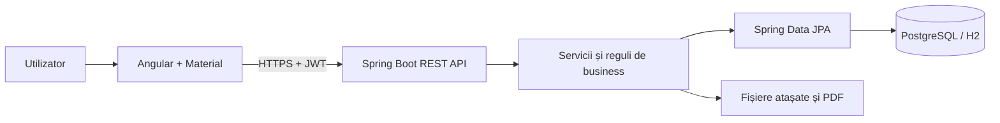

# Employee Leave Hub — Tăranu Ionuț

Aplicație web completă pentru gestionarea concediilor angajaților: depunere, aprobare, respingere, anulare, solduri, calendar comun, documente justificative, rapoarte și export PDF.

Proiect realizat de **Tăranu Ionuț** pentru practica de specialitate, pe baza cerințelor din tema **Employee Leave Hub**.

## Ce oferă aplicația

- autentificare securizată cu JWT și parole criptate;
- trei roluri cu acces separat: `EMPLOYEE`, `MANAGER`, `ADMIN`;
- ciclul complet al cererii: `DRAFT → PENDING → APPROVED / REJECTED`, plus anulare;
- calcul automat al zilelor lucrătoare, fără weekenduri și sărbători legale din România;
- verificarea soldului la depunere și actualizarea lui la aprobare;
- atașamente PDF/JPG/PNG și obligativitatea documentului pentru tipurile configurate;
- istoric complet al schimbărilor de stare și al persoanei care le-a efectuat;
- calendar de echipă, filtre și avertizare când lipsesc simultan prea mulți angajați;
- generarea cererii și a rapoartelor în format PDF;
- administrarea angajaților, departamentelor și tipurilor de concediu;
- interfață adaptată pentru desktop, tabletă și telefon.

## Tehnologii

| Zonă | Tehnologie |
|---|---|
| Frontend | Angular 21, Angular Material, TypeScript, SCSS |
| Backend | Java 21, Spring Boot 4, Spring Security, Spring Data JPA |
| Date | PostgreSQL 17 în producție/demo persistent, H2 pentru pornire rapidă |
| Migrații | Flyway |
| Autentificare | JWT |
| PDF | OpenPDF și fonturi Noto Sans încorporate |
| Build | Maven Wrapper și npm |

## Pornire rapidă — fără instalarea unei baze de date

Ai nevoie de Java 21 și Node.js 20.19+ sau 22.12+.

1. Deschide un terminal în `backend` și pornește serverul:

   ```powershell
   .\mvnw.cmd spring-boot:run
   ```

2. Deschide alt terminal în `frontend`:

   ```powershell
   npm install
   npm start
   ```

3. Deschide [http://localhost:4200](http://localhost:4200).

Baza H2 este creată automat în memorie și încărcată cu date demonstrative. La repornirea backendului, datele revin la forma inițială.

## Conturi demonstrative

Toate conturile au parola `Demo123!`.

| Rol | E-mail | Ce poate demonstra |
|---|---|---|
| Administrator | `admin@leavehub.ro` | toate cererile, rapoarte și administrare |
| Manager Engineering | `manager@leavehub.ro` | aprobările și calendarul departamentului |
| Manager Finance | `finance.manager@leavehub.ro` | separarea datelor între departamente |
| Angajat | `ana.popescu@leavehub.ro` | creare, trimitere și anulare cerere |
| Angajat | `mihai.ionescu@leavehub.ro` | cerere în așteptare pentru aprobarea managerului |
| Angajat | `elena.gheorghe@leavehub.ro` | utilizator din alt departament |

## Pornire cu PostgreSQL

Docker Desktop trebuie să fie pornit.

```powershell
docker compose up -d
cd backend
.\mvnw.cmd spring-boot:run "-Dspring-boot.run.profiles=postgres"
```

Valorile implicite sunt baza `leavehub`, utilizatorul `leavehub`, parola `leavehub` și portul `5432`. Pot fi schimbate prin `DB_URL`, `DB_USERNAME`, `DB_PASSWORD` și `JWT_SECRET`.

## Teste și build

Backend:

```powershell
cd backend
.\mvnw.cmd test
.\mvnw.cmd clean package
```

Frontend:

```powershell
cd frontend
npm test -- --watch=false
npm run build
```

JAR-ul rezultat se găsește în `backend/target/employee-leave-hub-api.jar`, iar frontendul compilat în `frontend/dist/frontend/browser`.

## Structura proiectului

```text
employee-leave-hub/
├── backend/              API REST, securitate, reguli, acces la date și PDF
├── frontend/             interfața Angular
├── docs/                 arhitectură și referință API
├── compose.yml           PostgreSQL local prin Docker
├── GHID_PREZENTARE.md    explicații și scenariu de demonstrație
└── README.md             instalare și utilizare
```

## Arhitectură pe scurt



Detaliile sunt în [docs/ARHITECTURA.md](docs/ARHITECTURA.md), iar endpointurile în [docs/API.md](docs/API.md).

## Observații pentru producție

Configurația implicită este destinată demonstrației. Pentru publicare reală trebuie schimbat secretul JWT, dezactivate datele demo (`app.demo-data=false`), folosit HTTPS și configurată o locație persistentă/externă pentru atașamente.
