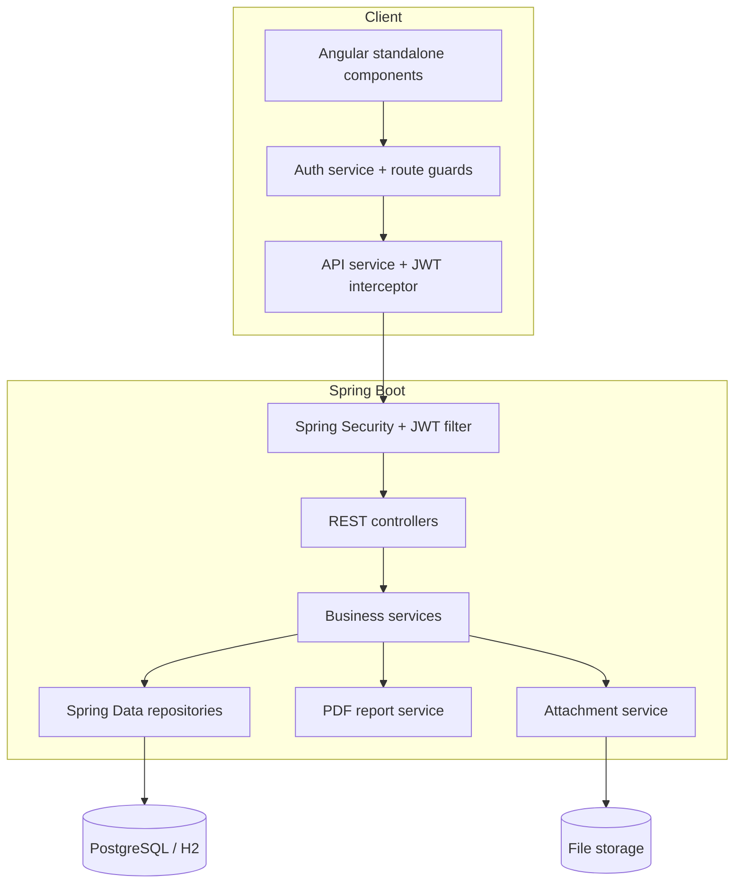
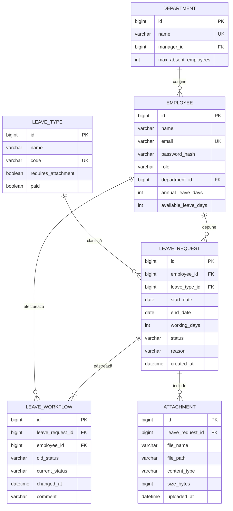
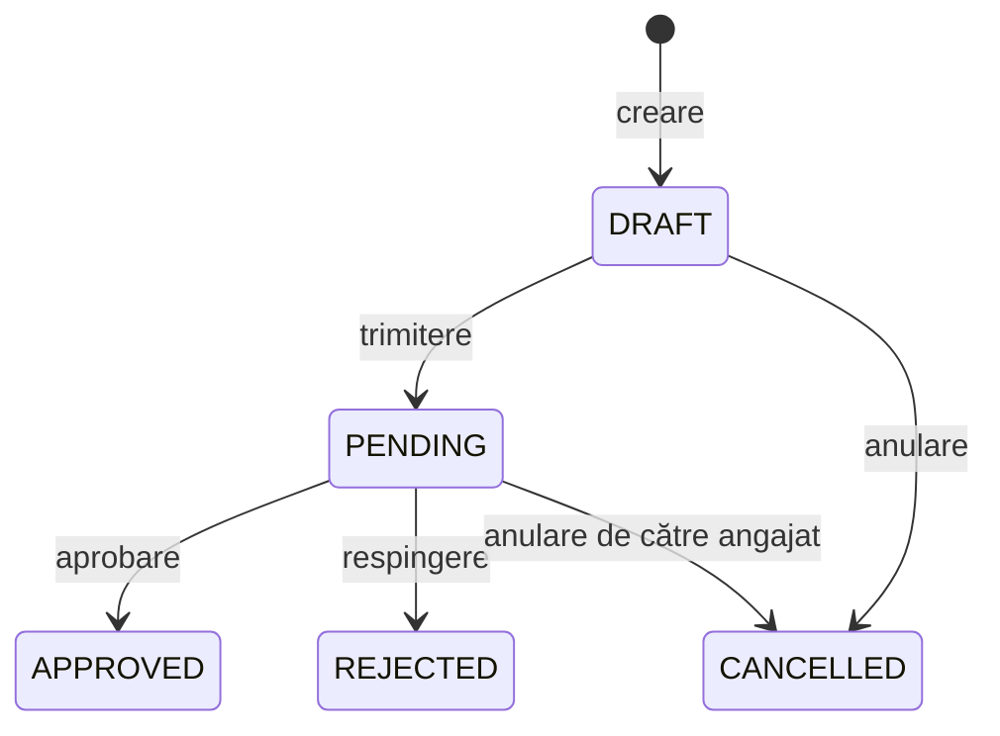

# Arhitectura aplicației

## Componente

Frontendul este împărțit pe funcționalități (`login`, `dashboard`, `requests`, `calendar`, `reports`, `administration`) și încarcă paginile la nevoie. Backendul separă controllerele HTTP de servicii, entități și repository-uri.

## Model relațional

## Ciclul de viață

Nu există tranziții directe între `APPROVED`, `REJECTED` și `CANCELLED`. Regulile sunt verificate în backend, nu doar în interfață.

## Securitate

1. Utilizatorul trimite e-mailul și parola la `/api/auth/login`.
2. Parola este verificată cu BCrypt.
3. Serverul returnează un JWT semnat, cu identificatorul și rolul utilizatorului.
4. Frontendul adaugă tokenul în antetul `Authorization: Bearer ...`.
5. Filtrul JWT autentifică apelul, iar serviciile verifică rolul, proprietarul și departamentul.

## Date și tranzacții

Flyway creează schema prin migrarea `V1__create_leave_hub_schema.sql`. Hibernate validează că entitățile Java corespund schemei. Operațiile de aprobare/respingere sunt tranzacționale pentru ca starea, soldul și istoricul să rămână consistente chiar dacă apare o eroare.
